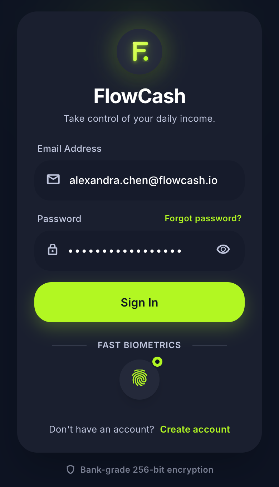
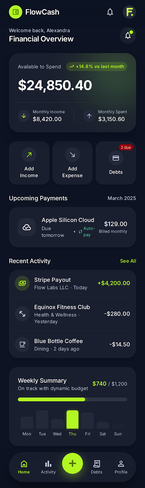
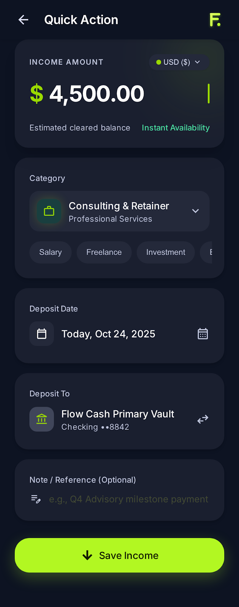
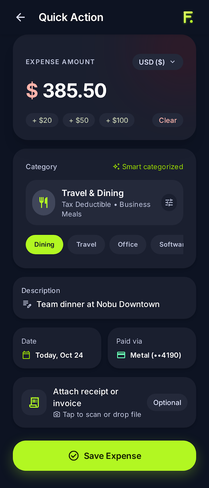
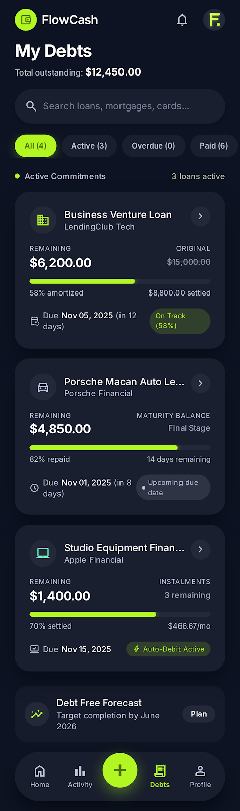
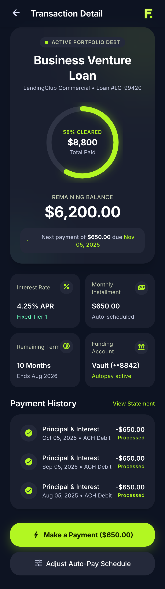
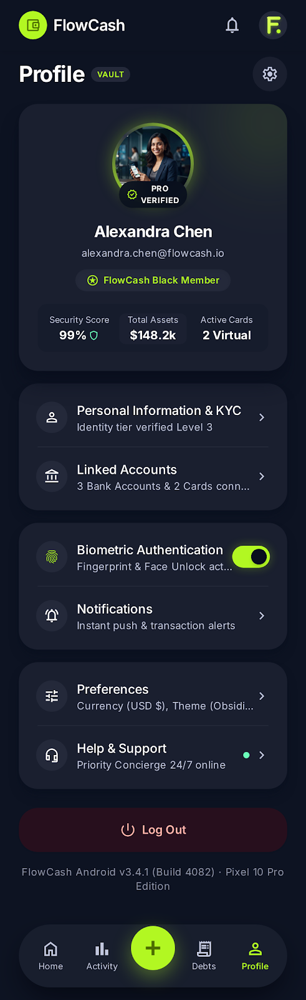

# FlowCash

> Controla tu dinero diario sin hacer cuentas mentales.

FlowCash es una aplicación móvil enfocada en personas que reciben ingresos diarios (por ejemplo, meseros, vendedores, repartidores o trabajadores independientes) y necesitan saber cuánto pueden gastar, cuánto deben separar para sus obligaciones y cuánto llevan ahorrado, todo desde un dashboard simple y visual.

---

## Integrantes

| Nombre | Rol |
|---------|-----|
| Samuel Mendoza | Desarrollo |
| Maria Jose Martinez | Desarrollo |

> Agrega aquí los demás integrantes si el proyecto es grupal.

---

## Tecnologías

- Next.js 15
- React
- TypeScript
- Tailwind CSS
- Supabase (PostgreSQL + Auth)
- Vercel

---

## Cómo ejecutar el proyecto

### Requisitos previos

Asegúrate de tener instalado:

- Flutter SDK (3.x o superior)
- Dart SDK (incluido con Flutter)
- Android Studio o Xcode (para emuladores)
- VS Code o Android Studio con la extensión de Flutter

Verifica la instalación con:

```bash
flutter doctor
```

Todos los apartados deben aparecer sin errores críticos antes de continuar.

### 1. Clonar el repositorio

```bash
git clone https://github.com/usuario/flowcash.git
cd flowcash
```

### 2. Instalar las dependencias

Flutter descarga automáticamente las dependencias definidas en `pubspec.yaml`.

```bash
flutter pub get
```

### 3. Configurar variables de entorno (si aplica)

Si el proyecto utiliza Supabase, crea un archivo `.env` (o el método de configuración definido en el proyecto) con las credenciales correspondientes.

```env
SUPABASE_URL=tu_url
SUPABASE_ANON_KEY=tu_key
```

### 4. Ejecutar la aplicación

Comprueba que haya un dispositivo o emulador disponible:

```bash
flutter devices
```

Luego inicia la aplicación:

```bash
flutter run
```

### Compilar para producción

Android (APK):

```bash
flutter build apk
```

Android (App Bundle):

```bash
flutter build appbundle
```

iOS (macOS):

```bash
flutter build ios
```

---

## Estructura del proyecto

```text
flowcash/
├── app/
├── components/
├── lib/
├── docs/
│   └── definicion.md
├── public/
│   └── screenshots/
└── README.md
```

---

## Capturas del proyecto

### P-01 · Inicio de sesión



### P-02 · Dashboard



### P-03 · Registrar ingreso



### P-04 · Registrar gasto



### P-05 · Lista de deudas



### P-06 · Detalle de deuda



### P-07 · Perfil



---

## Documentación

La documentación principal del proyecto se encuentra en:

**📄 [docs/definicion.md](docs/definicion.md)**

Este documento contiene:

- Definición del problema.
- Objetivos.
- Público objetivo.
- Alcance del MVP.
- Funcionalidades.
- Requisitos.
- Arquitectura inicial.

---

## Estado del proyecto

🚧 En desarrollo (MVP).

Actualmente se encuentran definidos:

- Diseño del producto.
- Arquitectura técnica.
- Modelo de datos.
- Sistema de diseño.
- Flujo de pantallas.
