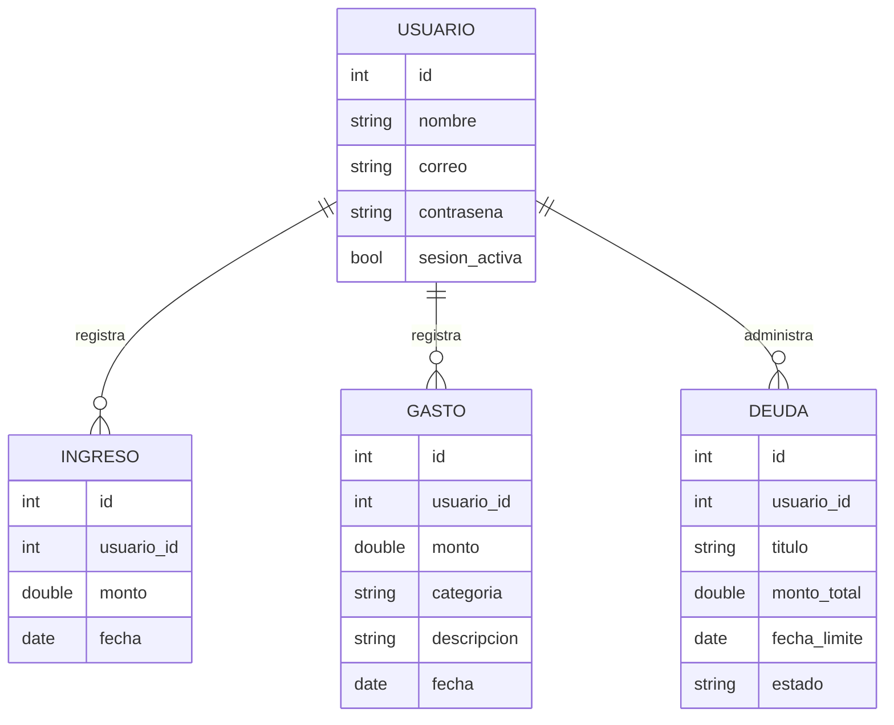
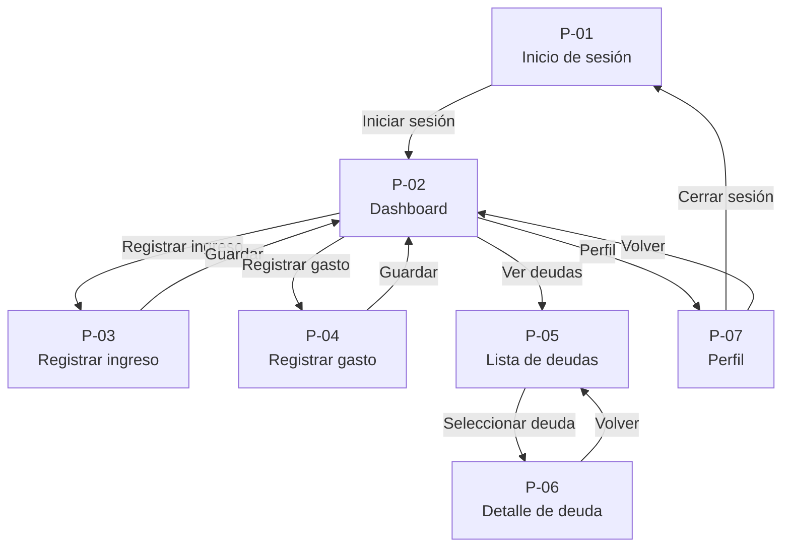

# FlowCash

| **Campo** | **Información** |
|-----------|-----------------|
| **Integrantes** | Samuel Mendoza Loaiza, Maria Jose Martinez|
| **Curso y grupo** | Programación Móvil (IF2004), Grupo [602] |
| **Versión** | 1.0 |
| **Fecha** | 24 de septiembre de 2026 |

## Tabla de contenido

1. [Descripción general](#1-descripción-general)
2. [Problema](#2-problema)
3. [Objetivos](#3-objetivos)
4. [Stakeholders, actores y roles](#4-stakeholders-actores-y-roles)
5. [Alcance](#5-alcance)
6. [Funcionalidades](#6-funcionalidades)
7. [Requerimientos funcionales](#7-requerimientos-funcionales)
8. [Requerimientos no funcionales](#8-requerimientos-no-funcionales)
9. [Reglas de negocio](#9-reglas-de-negocio)
10. [Modelo de datos](#10-modelo-de-datos)
11. [Pantallas y mapa de navegación](#11-pantallas-y-mapa-de-navegación)
12. [Mockup](#12-mockup)
13. [Historias de usuario, casos de uso, restricciones y supuestos](#13-historias-de-usuario-casos-de-uso-restricciones-y-supuestos)
14. [Arquitectura técnica y navegación implementada](#14-arquitectura-técnica-y-navegación-implementada)
15. [Historial de cambios](#historial-de-cambios)
16. [Referencias](#referencias)
17. [Declaración de uso de inteligencia artificial](#declaración-de-uso-de-inteligencia-artificial)

## 1. Descripción general

**FlowCash** es una aplicación móvil diseñada para personas que reciben ingresos diarios en efectivo, como vendedores, meseros, conductores y trabajadores independientes. Su propósito es ayudar a administrar el dinero del día sin perder de vista las obligaciones futuras, permitiendo que el usuario sepa cuánto puede gastar realmente sin comprometer pagos importantes.

Actualmente, muchas personas que cobran diariamente toman decisiones de gasto basándose únicamente en el dinero que tienen disponible en el momento. Esto dificulta separar el dinero destinado a deudas, servicios, ahorro o gastos próximos, lo que puede generar retrasos en los pagos, desorden financiero y la sensación de que el dinero desaparece sin saber exactamente en qué se utilizó.

FlowCash busca resolver ese problema mediante una experiencia pensada para el uso cotidiano desde el teléfono móvil. El usuario registra sus ingresos y gastos de forma rápida, consulta el dinero disponible para gastar según sus compromisos pendientes y visualiza sus próximas obligaciones desde una única aplicación.

La aplicación está orientada a un uso frecuente durante el día, con una interfaz simple que permita registrar movimientos en pocos pasos y consultar la información más importante sin necesidad de realizar cálculos manuales ni llevar cuentas en papel o en hojas de cálculo.

## 2. Problema

Muchas personas que reciben ingresos diarios en efectivo, como vendedores, meseros, conductores y trabajadores independientes, administran su dinero con base en lo que tienen disponible en el bolsillo ese mismo día. Aunque este método funciona para cubrir gastos inmediatos, dificulta separar el dinero destinado a deudas, servicios, ahorro o compromisos próximos, lo que puede provocar retrasos en los pagos, gastos impulsivos y una pérdida de control sobre el presupuesto personal.

Un ejemplo común es una persona que gana aproximadamente **$60.000 COP diarios** y debe pagar obligaciones en fechas específicas, como la cuota de un viaje, servicios o deudas personales. Al no conocer cuánto debe reservar cada día o cada semana, termina utilizando parte del dinero destinado a esos pagos y luego necesita reorganizar sus finanzas cuando llega la fecha límite.

Las herramientas tradicionales, como hojas de cálculo o anotaciones en papel, suelen requerir cálculos manuales y no están adaptadas al ritmo de quienes registran ingresos y gastos varias veces durante el día. Además, muchas aplicaciones de finanzas personales están enfocadas en usuarios con salario mensual fijo y no ofrecen una experiencia pensada para ingresos variables y diarios.

Por esta razón, la solución se plantea como una **aplicación móvil**. El teléfono es el dispositivo que el usuario lleva consigo durante toda su jornada laboral, lo que permite registrar ingresos y gastos en el momento en que ocurren, consultar cuánto dinero puede gastar realmente y revisar sus próximas obligaciones sin depender de un computador ni de cálculos manuales.

## 3. Objetivos

### 3.1 Objetivo general

Desarrollar una aplicación móvil que permita a personas con ingresos diarios registrar sus movimientos financieros y conocer cuánto dinero pueden gastar sin afectar sus obligaciones futuras, mediante una experiencia simple y accesible desde el teléfono.

### 3.2 Objetivos específicos

- Permitir que el usuario registre un ingreso o un gasto en **menos de 30 segundos** desde la aplicación.
- Mostrar el dinero disponible para gastar considerando los ingresos registrados y las obligaciones pendientes, con un cálculo actualizado después de cada movimiento.
- Permitir consultar las deudas y próximos pagos desde una lista organizada, con acceso al detalle de cada obligación en un máximo de **dos toques**.
- Centralizar el historial de ingresos, gastos y deudas dentro de la aplicación para que el usuario pueda consultar su información sin depender de cálculos manuales o registros en papel.

## 4. Stakeholders, actores y roles

### 4.1 Stakeholders

| Stakeholder | Interés en el proyecto |
|-------------|-------------------------|
| Freelancers y trabajadores independientes | Son el principal público objetivo. Buscan una herramienta que les ayude a administrar ingresos variables, planificar pagos futuros y mantener un mayor control financiero. |
| Otros trabajadores con ingresos diarios | Personas como conductores, vendedores o meseros pueden beneficiarse de la misma solución al enfrentar problemas similares para organizar su dinero. |
| Equipo desarrollador | Diseña, implementa y mejora la aplicación con base en las necesidades identificadas en el problema. |

### 4.2 Roles de usuario

| Rol | ¿Qué puede hacer? |
|-----|-------------------|
| Usuario (Freelancer) | Registrar ingresos diarios, registrar gastos, consultar el dinero disponible, administrar deudas y revisar el detalle de sus obligaciones. |

### 4.3 Inicio de sesión (Login)

El acceso a la aplicación se realiza mediante **correo electrónico y contraseña**. Una vez iniciada la sesión, esta permanecerá activa hasta que el usuario decida cerrarla, evitando que tenga que autenticarse cada vez que abra la aplicación.

## 5. Alcance

Esta primera versión de FlowCash corresponde a un **Producto Mínimo Viable (MVP)** enfocado en resolver el problema principal de los freelancers y trabajadores con ingresos diarios: saber cuánto dinero pueden gastar sin afectar sus obligaciones futuras. El alcance se limita a las funciones que el equipo puede desarrollar y demostrar funcionando durante el semestre.

### 5.1 Incluye

- Inicio de sesión mediante correo electrónico y contraseña.
- Persistencia de la sesión del usuario hasta que decida cerrarla.
- Registro manual de ingresos diarios.
- Registro manual de gastos con categoría y descripción.
- Cálculo automático del dinero disponible después de cada ingreso o gasto registrado.
- Creación y administración de deudas u obligaciones con monto y fecha límite.
- Visualización de una lista de deudas organizadas por prioridad o fecha de vencimiento.
- Consulta del detalle de cada deuda desde la lista (flujo lista → detalle).
- Panel principal (Dashboard) con un resumen del estado financiero del usuario.
- Historial de ingresos y gastos registrados dentro de la aplicación.
- Almacenamiento local de la información para conservar los datos entre aperturas de la aplicación.
- Navegación completa entre todas las pantallas definidas en el proyecto mediante `Navigator.push` y `Navigator.pop`.
- Compatibilidad con dispositivos Android.

### 5.2 No incluye

- Sincronización en la nube entre varios dispositivos.
- Versión web de la aplicación.
- Versión para iOS.
- Integración con bancos o billeteras digitales.
- Importación automática de movimientos bancarios.
- Pagos o transferencias desde la aplicación.
- Presupuestos compartidos entre varios usuarios.
- Múltiples cuentas o perfiles familiares.
- Modo colaborativo para equipos o empresas.

## 6. Funcionalidades

Las funcionalidades de FlowCash están organizadas según el único rol de usuario definido para esta primera versión de la aplicación.

### Usuario (Freelancer)

El usuario puede:

- Iniciar y cerrar sesión mediante correo electrónico y contraseña.
- Consultar el panel principal con un resumen de su estado financiero.
- Registrar ingresos diarios indicando el monto y la fecha del movimiento.
- Registrar gastos indicando el monto, la categoría y una descripción.
- Consultar el dinero disponible para gastar según los ingresos registrados y las obligaciones pendientes.
- Crear deudas u obligaciones con un monto y una fecha límite de pago.
- Visualizar una lista de todas sus deudas organizadas por prioridad o fecha de vencimiento.
- Consultar el detalle de una deuda seleccionada desde la lista.
- Consultar el historial de ingresos y gastos registrados.
- Mantener su información disponible entre una apertura y la siguiente de la aplicación gracias al almacenamiento local.
- Navegar entre todas las pantallas de la aplicación mediante una interfaz diseñada para dispositivos móviles Android.

## 7. Requerimientos funcionales

| ID | Requerimiento | Rol | Prioridad |
|----|--------------|-----|-----------|
| RF-01 | La aplicación debe permitir al usuario iniciar sesión mediante correo electrónico y contraseña. | Usuario | Alta |
| RF-02 | La aplicación debe mantener la sesión iniciada hasta que el usuario decida cerrarla. | Usuario | Media |
| RF-03 | La aplicación debe mostrar un panel principal con el resumen del estado financiero del usuario. | Usuario | Alta |
| RF-04 | La aplicación debe permitir registrar ingresos indicando el monto y la fecha del movimiento. | Usuario | Alta |
| RF-05 | La aplicación debe permitir registrar gastos indicando el monto, la categoría y una descripción. | Usuario | Alta |
| RF-06 | La aplicación debe actualizar automáticamente el dinero disponible después de registrar un ingreso o un gasto. | Usuario | Alta |
| RF-07 | La aplicación debe permitir crear deudas indicando el monto y la fecha límite de pago. | Usuario | Alta |
| RF-08 | La aplicación debe mostrar una lista con todas las deudas registradas por el usuario. | Usuario | Alta |
| RF-09 | La aplicación debe permitir consultar el detalle de una deuda seleccionada desde la lista. | Usuario | Alta |
| RF-10 | La aplicación debe mostrar el historial de ingresos y gastos registrados. | Usuario | Media |
| RF-11 | La aplicación debe conservar la información registrada entre una apertura y la siguiente mediante almacenamiento local. | Todos | Alta |
| RF-12 | La aplicación debe permitir navegar entre todas las pantallas definidas en el mapa de navegación utilizando los controles de la interfaz. | Todos | Alta |

## 8. Requerimientos no funcionales

| ID | Categoría | Requerimiento |
|----|-----------|---------------|
| RNF-01 | Sin conexión | La aplicación debe conservar los ingresos, gastos y deudas registrados aunque el usuario cierre y vuelva a abrir la aplicación. |
| RNF-02 | Rendimiento | La aplicación debe iniciar y mostrar el Dashboard en menos de **3 segundos** en un dispositivo Android de gama media. |
| RNF-03 | Rendimiento | El cálculo del dinero disponible debe actualizarse en menos de **1 segundo** después de registrar un ingreso o un gasto. |
| RNF-04 | Usabilidad | Todos los botones y elementos táctiles deben tener un área mínima de **48 × 48 píxeles lógicos** para facilitar su interacción. |
| RNF-05 | Usabilidad | El usuario debe poder acceder al detalle de una deuda desde la lista en un máximo de **2 toques**. |
| RNF-06 | Compatibilidad | La aplicación debe funcionar en dispositivos con **Android 8.0 (API 26)** o superior. |
| RNF-07 | Compatibilidad | La interfaz debe adaptarse correctamente a pantallas entre **5 y 6,8 pulgadas** sin que los elementos principales queden cortados o superpuestos. |
| RNF-08 | Seguridad | La contraseña del usuario no debe almacenarse en texto plano dentro del dispositivo. |
| RNF-09 | Consumo de recursos | La aplicación debe funcionar sin requerir conexión permanente a Internet para consultar la información previamente guardada. |
| RNF-10 | Consistencia | Todas las pantallas deben mantener una navegación uniforme utilizando botones de regreso y una distribución visual consistente durante toda la aplicación. |

## 9. Reglas de negocio

Las siguientes reglas establecen las condiciones que la aplicación debe respetar al administrar la información financiera del usuario.

| ID | Regla de negocio |
|----|------------------|
| RN-01 | Todo ingreso registrado debe tener un monto mayor que **$0 COP**. |
| RN-02 | Todo gasto registrado debe tener un monto mayor que **$0 COP**. |
| RN-03 | Toda deuda debe registrarse con una fecha límite de pago obligatoria. |
| RN-04 | El dinero disponible debe recalcularse automáticamente después de cada ingreso o gasto registrado. |
| RN-05 | Cada deuda pertenece únicamente al usuario que la creó. |
| RN-06 | El historial financiero debe conservar el registro de los movimientos realizados y no eliminarse automáticamente al cerrar la aplicación. |
| RN-07 | Las deudas deben mostrarse priorizando las que tienen la fecha de vencimiento más cercana. |
| RN-08 | Un movimiento financiero no puede registrarse si el monto ingresado es igual a cero o está vacío. |
| RN-09 | El detalle de una deuda siempre debe corresponder a la deuda seleccionada desde la lista y no mostrar información de otra obligación. |
| RN-10 | El cierre de sesión no debe eliminar la información financiera almacenada del usuario en el dispositivo. |

## 10. Modelo de datos

FlowCash almacena la información financiera del usuario directamente en el dispositivo durante esta primera versión del proyecto. El modelo de datos está compuesto por cuatro entidades principales: **Usuario**, **Ingreso**, **Gasto** y **Deuda**.

### 10.1 Entidades

| Entidad | Atributos principales | Dónde se guarda |
|----------|-----------------------|-----------------|
| Usuario | id, nombre, correo, contraseña, sesion_activa | Teléfono (sesión y datos del usuario) |
| Ingreso | id, usuario_id, monto, fecha | Teléfono |
| Gasto | id, usuario_id, monto, categoria, descripcion, fecha | Teléfono |
| Deuda | id, usuario_id, titulo, monto_total, fecha_limite, estado | Teléfono |

### 10.2 Relaciones entre entidades

- Un **Usuario** puede registrar muchos **Ingresos**.
- Un **Usuario** puede registrar muchos **Gastos**.
- Un **Usuario** puede registrar muchas **Deudas**.
- Cada **Ingreso** pertenece a un único Usuario.
- Cada **Gasto** pertenece a un único Usuario.
- Cada **Deuda** pertenece a un único Usuario.

### 10.3 Diagrama del modelo de datos



### 10.4 Distribución del almacenamiento

En esta primera versión de FlowCash toda la información financiera se almacena localmente en el dispositivo Android. Esto permite que el usuario conserve sus ingresos, gastos y deudas entre una apertura y la siguiente de la aplicación, incluso sin conexión a Internet. No se contempla una base de datos en la nube ni sincronización entre dispositivos dentro del alcance del MVP.

## 11. Pantallas y mapa de navegación

FlowCash está compuesto por siete pantallas principales que permiten al usuario recorrer todas las funciones del MVP. Cada pantalla tiene un identificador único (`P-01` a `P-07`), un propósito específico y está relacionada con los requerimientos funcionales definidos en la Sección 7.

### 11.1 Pantallas

| ID | Pantalla | Rol | Propósito | Atiende |
|----|----------|-----|-----------|----------|
| P-01 | Inicio de sesión | Usuario | Permitir el acceso mediante correo y contraseña. | RF-01, RF-02 |
| P-02 | Dashboard | Usuario | Mostrar el resumen financiero, dinero disponible y accesos rápidos. | RF-03, RF-06 |
| P-03 | Registrar ingreso | Usuario | Registrar un nuevo ingreso mediante un formulario. | RF-04 |
| P-04 | Registrar gasto | Usuario | Registrar un nuevo gasto mediante un formulario. | RF-05 |
| P-05 | Lista de deudas | Usuario | Mostrar todas las deudas registradas en una lista. | RF-07, RF-08 |
| P-06 | Detalle de deuda | Usuario | Mostrar la información completa de la deuda seleccionada. | RF-09 |
| P-07 | Perfil | Usuario | Consultar la información del usuario y cerrar sesión. | RF-02 |

### 11.2 Flujo principal de navegación

El recorrido principal comienza con el inicio de sesión. Después de autenticarse, el usuario accede al Dashboard, desde donde puede registrar ingresos, registrar gastos, consultar sus deudas o acceder a su perfil.

El requisito de **lista a detalle** se cumple cuando el usuario selecciona una deuda en la pantalla **P-05 Lista de deudas**, enviando la información de esa deuda a **P-06 Detalle de deuda**, donde se muestra la información correspondiente al elemento seleccionado.

### 11.3 Mapa de navegación



### 11.4 Paso de datos entre pantallas

El recorrido entre **P-05 Lista de deudas** y **P-06 Detalle de deuda** envía la deuda seleccionada como parámetro durante la navegación. De esta forma, el detalle siempre corresponde al elemento elegido por el usuario y no muestra información fija, cumpliendo el requisito del flujo de lista a detalle definido para el proyecto.

## 12. Mockup

Esta sección presenta la propuesta visual de FlowCash para dispositivos móviles Android. Cada imagen corresponde a una de las pantallas definidas en la Sección 11 y mantiene el mismo identificador (`P-01` a `P-07`). Las imágenes se almacenarán en la carpeta `docs/mockup/` y servirán como referencia para la implementación del esqueleto navegable en Flutter.

> **Prototipo navegable:** *(Agregar aquí el enlace público de Figma o Google Stitch cuando esté disponible.)*

### P-01 – Inicio de sesión


Pantalla de autenticación con correo electrónico, contraseña y botón para ingresar. Es el punto de entrada de la aplicación.

---

### P-02 – Dashboard


Pantalla principal donde el usuario consulta su dinero disponible, el resumen financiero y los accesos rápidos a las funciones principales.

---

### P-03 – Registrar ingreso


Formulario para registrar un nuevo ingreso indicando el monto y la fecha del movimiento.

---

### P-04 – Registrar gasto


Formulario para registrar un gasto con monto, categoría y descripción, actualizando posteriormente el resumen financiero.

---

### P-05 – Lista de deudas


Pantalla que muestra todas las deudas registradas por el usuario en una lista organizada por prioridad o fecha de vencimiento.

---

### P-06 – Detalle de deuda


Vista detallada de la deuda seleccionada desde la lista, mostrando su monto, fecha límite y estado.

---

### P-07 – Perfil


Pantalla donde el usuario consulta su información personal y puede cerrar la sesión de la aplicación.

## 13. Historias de usuario, casos de uso, restricciones y supuestos

Esta sección describe cómo interactúa el usuario con FlowCash desde su perspectiva, los escenarios principales de uso y las condiciones bajo las cuales se desarrolla el proyecto.

### 13.1 Historias de usuario

**HU-01:** Como freelancer con ingresos diarios, quiero registrar mis ingresos de forma rápida para conocer cuánto dinero realmente puedo gastar durante el día.

**HU-02:** Como freelancer, quiero registrar mis gastos inmediatamente después de realizarlos para mantener actualizado mi presupuesto.

**HU-03:** Como freelancer, quiero ver cuánto dinero tengo disponible después de descontar mis obligaciones para tomar mejores decisiones de gasto.

**HU-04:** Como freelancer, quiero consultar una lista de mis deudas para identificar cuáles debo pagar primero.

**HU-05:** Como freelancer, quiero abrir el detalle de una deuda para revisar su monto, estado y fecha límite antes de realizar el pago.

**HU-06:** Como usuario, quiero iniciar sesión una sola vez y mantener mi sesión abierta para acceder rápidamente a mi información financiera.

### 13.2 Caso de uso principal

#### Caso de uso: Consultar el detalle de una deuda

**Actor:** Usuario (Freelancer)

**Precondición:** El usuario tiene la sesión iniciada y ha registrado al menos una deuda en la aplicación.

**Flujo principal:**

1. El usuario abre la aplicación e ingresa al Dashboard.
2. Selecciona la opción **Ver deudas**.
3. La aplicación muestra la lista de deudas registradas.
4. El usuario toca una deuda específica.
5. La aplicación abre la pantalla **P-06 Detalle de deuda** mostrando la información correspondiente a la deuda seleccionada.
6. El usuario puede regresar a la lista utilizando el botón de volver.

**Flujo alternativo:**

- Si el usuario aún no tiene deudas registradas, la aplicación muestra un mensaje indicando que no existen obligaciones pendientes y ofrece la opción de crear una nueva deuda.

### 13.3 Restricciones del proyecto

- La primera versión estará disponible únicamente para dispositivos Android.
- La información financiera se almacenará localmente en el dispositivo durante el alcance del MVP.
- La aplicación no incluirá sincronización entre varios dispositivos.
- No se integrará con bancos, billeteras digitales ni servicios externos de pago.
- La implementación utilizará Flutter y las herramientas vistas durante el curso.

### 13.4 Supuestos del proyecto

- El usuario dispone de un teléfono Android compatible con la aplicación.
- El usuario conoce el monto de sus ingresos y gastos y los registrará manualmente.
- El usuario cuenta con un correo electrónico para iniciar sesión.
- El registro frecuente de ingresos y gastos permitirá mantener actualizado el cálculo del dinero disponible.
- El usuario utilizará la aplicación como herramienta de apoyo para organizar sus finanzas personales, sin reemplazar procesos bancarios oficiales.

## 14. Arquitectura técnica y navegación implementada

Esta sección define la arquitectura técnica prevista para el MVP de **FlowCash** y establece cómo se relacionan las pantallas del documento con la estructura del proyecto en Flutter.

### 14.1 Entorno de desarrollo

| Elemento | Valor |
|----------|-------|
| Framework | Flutter |
| Lenguaje | Dart |
| Plataforma objetivo | Android |
| IDE recomendado | Visual Studio Code o Android Studio |
| Sistema de navegación | `Navigator.push()` y `Navigator.pop()` |

> Las versiones exactas de Flutter y Dart se actualizarán una vez se cree el proyecto y se ejecute `flutter --version`.

### 14.2 Paquetes previstos

Durante el desarrollo del MVP se utilizarán únicamente los paquetes necesarios para cumplir el alcance del proyecto.

| Paquete | Propósito |
|----------|-----------|
| `shared_preferences` | Conservar la sesión del usuario y configuraciones básicas. |
| `sqflite` | Almacenar localmente ingresos, gastos y deudas. |
| `path_provider` | Gestionar la ubicación del almacenamiento local cuando sea necesario. |

### 14.3 Estructura del proyecto

La aplicación estará organizada por pantallas y componentes reutilizables para mantener una estructura clara durante el desarrollo.

```text
lib/
│
├── main.dart
│
├── pantallas/
│   ├── login.dart
│   ├── dashboard.dart
│   ├── registrar_ingreso.dart
│   ├── registrar_gasto.dart
│   ├── lista_deudas.dart
│   ├── detalle_deuda.dart
│   └── perfil.dart
│
└── widgets/
    └── boton_principal.dart
```

### 14.4 Tabla de rutas

Cada pantalla del proyecto corresponde a un archivo específico dentro de `lib/pantallas/` y mantiene el mismo identificador definido en la Sección 11.

| Pantalla | Archivo | Se llega desde | Recibe |
|----------|---------|----------------|---------|
| P-01 Inicio de sesión | `lib/pantallas/login.dart` | Inicio de la aplicación | — |
| P-02 Dashboard | `lib/pantallas/dashboard.dart` | P-01 | — |
| P-03 Registrar ingreso | `lib/pantallas/registrar_ingreso.dart` | P-02 | — |
| P-04 Registrar gasto | `lib/pantallas/registrar_gasto.dart` | P-02 | — |
| P-05 Lista de deudas | `lib/pantallas/lista_deudas.dart` | P-02 | — |
| P-06 Detalle de deuda | `lib/pantallas/detalle_deuda.dart` | P-05 | La deuda seleccionada |
| P-07 Perfil | `lib/pantallas/perfil.dart` | P-02 | — |

### 14.5 Navegación implementada

La navegación seguirá el mapa definido en la Sección 11 utilizando el sistema nativo de Flutter (`Navigator.push()` y `Navigator.pop()`), sin emplear librerías de navegación adicionales.

El recorrido principal será el siguiente:

1. El usuario inicia sesión en **P-01**.
2. Accede al **Dashboard (P-02)**.
3. Desde el Dashboard puede abrir las pantallas de registrar ingresos, registrar gastos, consultar deudas o acceder al perfil.
4. Desde **P-05 Lista de deudas** podrá abrir **P-06 Detalle de deuda**, enviando la deuda seleccionada como parámetro durante la navegación.
5. El botón de volver (`Navigator.pop()`) regresará a la pantalla anterior, manteniendo un flujo consistente durante toda la aplicación.

## Historial de cambios

| Fecha | Versión | Cambio realizado | Responsable |
|--------|---------|------------------|-------------|
| 25/09/2026 | 1.0 | Creación de la primera versión del documento de definición del proyecto FlowCash con las 14 secciones del entregable. | Equipo |

## Referencias

| Referencia | Uso en el documento |
|------------|---------------------|
| Flutter. *Navigation and routing*. https://docs.flutter.dev/ui/navigation | Sección 14 (Arquitectura técnica y navegación). |
| Flutter. *Cookbook: Navigation*. https://docs.flutter.dev/cookbook/navigation | Secciones 11 y 14 (Mapa de navegación y uso de `Navigator.push` y `Navigator.pop`). |
| Android Developers. *Android API Levels*. https://developer.android.com/about/versions | Sección 8 (Compatibilidad con Android 8.0 API 26 o superior). |
| Flutter. *shared_preferences package*. https://pub.dev/packages/shared_preferences | Sección 14 (Persistencia de la sesión del usuario). |
| Flutter. *sqflite package*. https://pub.dev/packages/sqflite | Secciones 10 y 14 (Almacenamiento local de ingresos, gastos y deudas). |

## Declaración de uso de inteligencia artificial

Durante la elaboración de este documento se utilizó un asistente de inteligencia artificial (ChatGPT) como herramienta de apoyo para estructurar el documento en formato Markdown, revisar la redacción, mejorar la claridad de las secciones y verificar la consistencia entre los objetivos, requerimientos, modelo de datos, mapa de navegación y arquitectura técnica.

El equipo proporcionó la idea original del proyecto, definió el problema, el público objetivo, el alcance del MVP y validó las decisiones tomadas en cada sección. Las propuestas generadas fueron revisadas, adaptadas y aceptadas únicamente cuando coincidían con los objetivos del proyecto y con los requisitos establecidos en la guía del entregable.

No se utilizó la inteligencia artificial para reemplazar la comprensión del proyecto ni para justificar funcionalidades fuera del alcance definido por el equipo.